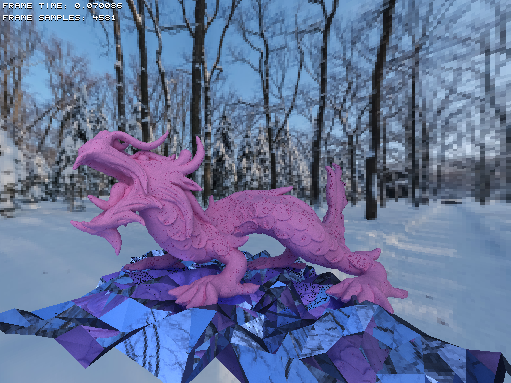

# GPU-raytracer-INFOMAGR

Raytracer implemented both on cpu and gpu using BVHs for rendering complicated 3d meshes in real-time. Uses BVHs to find intersections more efficiently. Gpu implementation uses wavefront
path tracing and requires CUDA runtime.

##
Running the project renders a fixed static scene consisting of ~250.000 triangles. Gpu implementation achieves a speedup of ~10x over the cpu implementation with the same
functionality.

